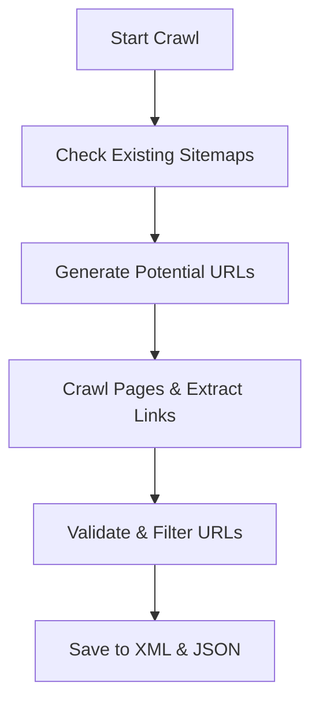

Got it ✅
Here’s your **polished, “GitHub Star-worthy” README** — no license section, but now with **badges, visuals, and a quick-start block** so it feels premium compared to average READMEs.

---

# Enhanced Finploy Sitemap Generator

[](#)
[](#)
[](#)

> **A smart, fast, and flexible sitemap generator for Finploy job portals**
> Crawls deeply, detects hidden links, and exports XML + JSON reports.

---

## 🚀 Quick Start

```bash
# 1. Clone the repo
git clone https://github.com/yourusername/enhanced-finploy-sitemap.git
cd enhanced-finploy-sitemap

# 2. Install dependencies
pip install -r requirements.txt

# 3. Run the generator
python sitemap.py
```

Generates:

* **`enhanced_sitemap.xml`** → Ready for search engines
* **`enhanced_sitemap_report.json`** → Detailed crawl report

---

## 📌 Overview

The **Enhanced Finploy Sitemap Generator** goes beyond basic crawlers:

* Discovers URLs from HTML, attributes, and embedded JavaScript.
* Generates job & location-specific links even if they’re not linked on the site.
* Filters irrelevant content to save time and bandwidth.
* Outputs clean, structured **XML sitemaps** + rich **JSON stats**.

---

## 🌟 Features

* **Deep Discovery**: Extracts links from HTML, attributes, and JavaScript.
* **Intelligent Guessing**: Generates potential job/location URLs.
* **Filtering**: Skips spammy or irrelevant file types.
* **Multi-format Output**: XML + JSON.
* **Logging**: Tracks progress and issues in `enhanced_sitemap.log`.

---

## 📂 Project Structure

```
.
├── sitemap.py                     # Main Python script
├── enhanced_sitemap.xml           # Generated XML sitemap
├── enhanced_sitemap_report.json   # Crawl report with stats
├── enhanced_sitemap.log           # Crawl logs
```

---

## 📊 Example Crawl Report

```json
{
  "generation_time": "2025-08-08T19:02:54.856315",
  "elapsed_minutes": 51.8,
  "total_urls_discovered": 2707,
  "total_urls_crawled": 2219,
  "failed_urls": 479,
  "success_rate": 82.2,
  "url_categories": {
    "job_listings": 1482,
    "company_pages": 4,
    "location_pages": 13,
    "department_pages": 22,
    "career_pages": 1,
    "other": 1185
  }
}
```

---

## ⚙️ Configuration

Edit `sitemap.py` to customize:

* **`base_urls`** → Domains to start crawling.
* **`delay`** → Delay between requests (default `0.5s`).
* **`max_urls`** → Max URLs to crawl.
* **`job_keywords`** / **`locations`** → Terms for generating potential URLs.

---

## 🖼 Visual Flow



---

## ⚠️ Disclaimer

Use this script **only** on domains you own or have permission to crawl.
Unauthorized crawling may violate a site's terms of service.

---

If you like this project, ⭐ star it on GitHub to support development!

---

I can also **create the `requirements.txt`** so your repo is 100% clone-and-run ready,
and prepare a **demo screenshot** of the XML + report for the README.

Do you want me to prepare those two extra things so your repo looks complete?
